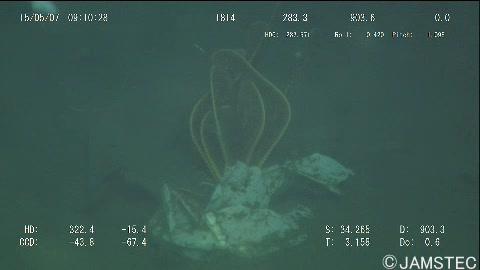

# Instance Segmentation with MMDetection and Docker

This repository contains instructions for performing Instance Segmentation task by training an RTMDet model using MMDetection with Docker.

## Prerequisites

Before you begin, ensure you have Docker installed on your system. If not, you can install it by following the instructions [here](https://docs.docker.com/get-docker/).

## Getting Started

Clone this GitHub repository:

```bash
git clone https://github.com/javad-rezaie/RTMDet_Instance_Segmentation.git
cd RTMDet_Instance_Segmentation
```

## Setting Up the Docker Environment


Build Docker image by running:

```bash
make docker-build-mmdetection
```

## Dataset Preparation

Run the Jupyter notebook from the terminal, execute the `download_data.sh` script:

```bash
bash download_data.sh
```
Follow Data_Preparation.ipynb

## Modifying the Paths and GPU Configuration

1. Update the `DATA_DIR` path inside the `train.sh` script to your appropriate local path where the dataset is located.
2. Update the `GPU` variable to the number of installed GPUs on your PC.

### Data Structure

#### Local Machine

On your local computer, the data structure is as follows:

/mnt/SSD2/General_CV_Training_Data/TrashCan/dataset/instance_version/ ├── train/ ├── val/ ├── instances_train_trashcan.json └── instances_val_trashcan.json


#### Container

Within the container, this directory is accessible as `/data` and will appear as:

/data/ ├── train/ ├── val/ ├── instances_train_trashcan.json └── instances_val_trashcan.json


The local path `/mnt/SSD2/General_CV_Training_Data/TrashCan/dataset/instance_version/` is mapped to `/data/` inside the container.

## Analysing log results:
Run the Jupyter notebook from the terminal, execute the `jupyter.sh` script:

```bash
bash jupyter.sh
```
Follow [Analyse_Logs.ipynb](./notebooks/Analyse_Logs.ipynb)


## Inference:
Run the Jupyter notebook from the terminal, execute the `jupyter.sh` script:

```bash
bash jupyter.sh
```
Follow [Inference.ipynb](./notebooks/Inference.ipynb) 

### Original Image:


### Inference Result:
). This allows for straightforward integration into applications and fine-tuning on custom datasets.

## Tips
Ensure that the `train.sh` and  `jupyter.sh` bash scripts has executable permissions. If not, grant execute permission by running `chmod u+x train.sh`.


## Disclaimer

This project is intended for educational purposes only. It is not intended to provide medical advice or any other professional advice. Any use of this project for real-world applications should be done with caution and proper consultation with relevant experts.

## License

This project is licensed under the This project is licensed under the Apache License 2.0 - see the [LICENSE](LICENSE) file for details.
